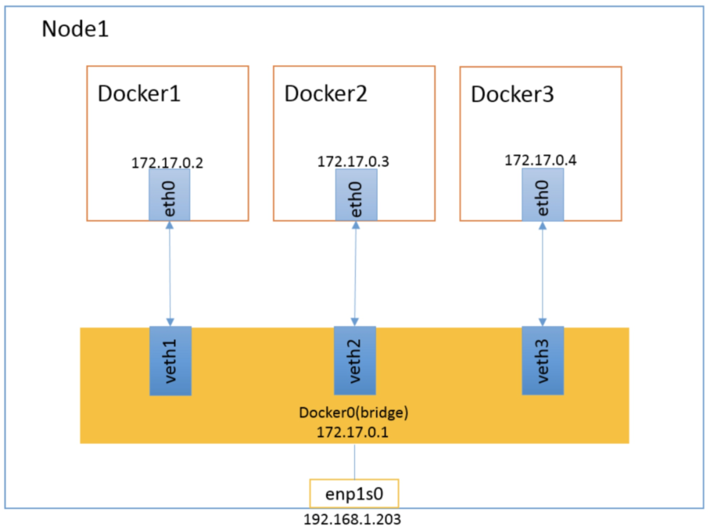
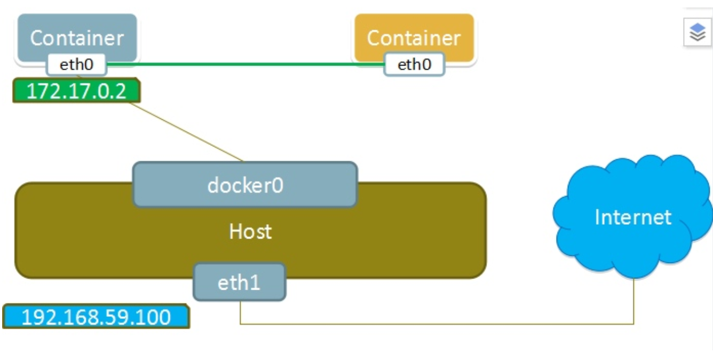
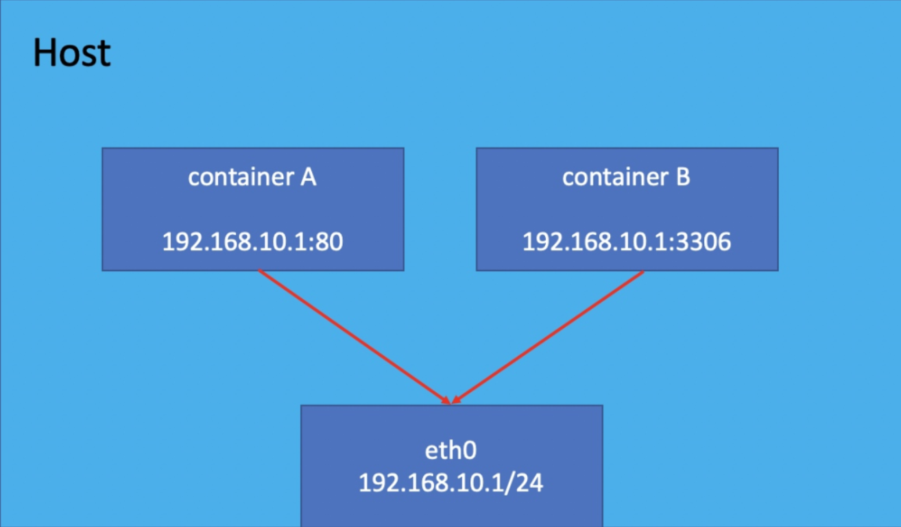

## 网络模式
Docker具有四种网络模式：
* `host`：使容器和宿主机共享网络命名空间；
* `container`：使容器和其他指定的容器共享网络命名空间；
* `none`：容器具有独立的网络命名空间，但是没有进行任何网络配置：如分配IP、网桥配置等；
* `bridge`：默认模式；

Docker的网络可以通过下面的命令查看，默认安装完成后提供了三种网络：
```bash
docker network ls

NETWORK ID          NAME                DRIVER              SCOPE
cd97bb997b84        bridge              bridge              local
0a04824fc9b6        host                host                local
4dcb8fbdb599        none                null                local
```

## bridge模式
docker启动时会在机器上创建一个名为`docker0`的虚拟网桥，在此机器上启动的容器都会默认连接到这个网桥上并由`docker0`从其分子网中分配一个IP给容器使用，`docker0`的IP将作为容器IP的网关；在主机上创建一对虚拟网卡`veth pair`设备，Docker将`veth pair`设备的一端放在新创建的容器中，并命名为`eth0`（容器的网卡），另一端放在主机中，以`vethxxx`这样类似的名字命名，并将这个网络设备加入到`docker0`网桥中。可以通过```brctl show``` 命令查看。

> `docker0`网桥的工作方式类似于物理交换机，这样所有的docker容器都通过`docker0`这个虚拟的交换机连接在一个二层网络中

bridge模式是docker的 **默认网络模式**，即启动容器时不用指定`--network`参数。



因为docker网桥是虚拟的，所以外部无法直接通过容器IP访问到容器中的服务，外部访问的话需要在容器启动时通过`-p`指定端口映射的方式访问。
> 当容器需要使用`docker run -p`对外映射端口时，docker实际是在iptables中做了`DNAT`规则，实现端口转发功能。可以使用 `iptables -t nat -vnL`查看

## container模式
这个模式指定新创建的容器和已经存在的一个容器共享一个Network Namespace，而不是和宿主机共享。

新创建的容器不会创建自己的网卡及IP，而是和一个指定的容器共享IP、端口范围等。同样，两个容器除了网络方面，其他的如文件系统、进程列表等还是隔离的。两个容器的进程可以通过`lo`网卡设备通信。

这种模式可以在创建容器时通过`--network container:NAME_or_ID`来指定和哪个容器互联。




## host模式
使用host模式的容器将和宿主机共用一个`Network Namespace`，容器将不会虚拟出自己的网卡和IP等，而是使用宿主机的IP和端口。但是容器的其他方面，如文件系统、进程列表等还是和宿主机隔离的。

使用host模式的容器可以直接使用宿主机的IP地址与外界通信，容器内部的服务端口也可以使用宿主机的端口，不需要进行NAT，host最大的优势就是网络性能比较好，但是宿主机上已经使用的端口就不能再用了，网络的隔离性不好。

这种模式可以在创建容器时通过`--network host`来启用。



## none模式
使用none模式的容器拥有自己的`Network Namespace`，但是并不为容器进行任何网络配置。也就是说这个容器没有网卡、IP、路由等信息。需要我们自己为容器添加网卡、配置IP等。

这种网络模式下容器只有`lo回环网络`，没有其他网卡。none模式可以在容器创建时通过`--network none`，来指定。这种类型的网络没有办法联网，封闭的网络能很好的保证容器的安全性。

## docker网络配置

### 自定义docker0网段
可以在docker的配置文件`/etc/daemon.json`中增加下面的配置来指定docker0使用的网段：
```json
{
    "bip": "192.168.1.5/24"
}
```

### 创建自定义的网络
可以通过如下的命令基于bridge模式创建一个网络：
```bash
docker network create my_network -d bridge
```

也可以创建一个额外的网桥以区别于docker0
```bash
docker network create -d bridge --subnet "172.16.2.0/24" --gateway "172.16.2.1" my_bridge
```

这个时候创建容器就可以使用自定义的网桥了：
```bash
docker run -it --name b1 --network my_bridge busybox
```
